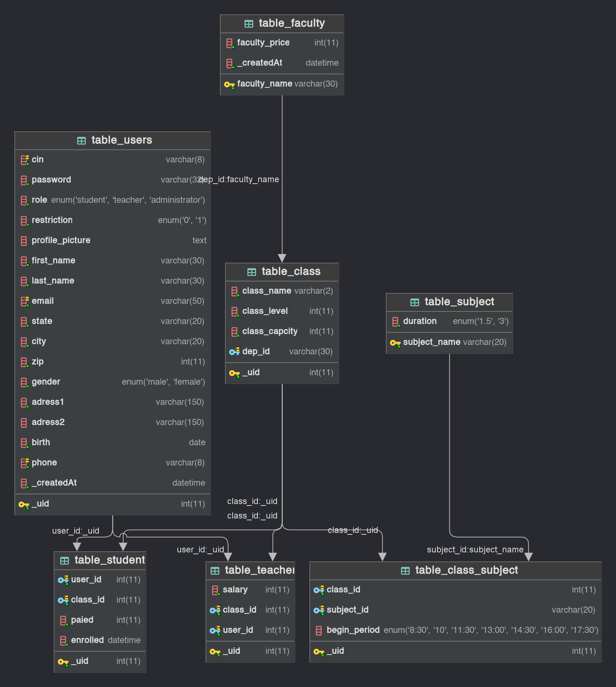

## School Management System

this is a school project it is a basic web application that is used to manage the school. where we manage student, teachers, departement and classes.
I used php for managing data, mysql for database tailwindcss for styling and alpine js for some javascript interactions like models, drawer and responsive design.

 

